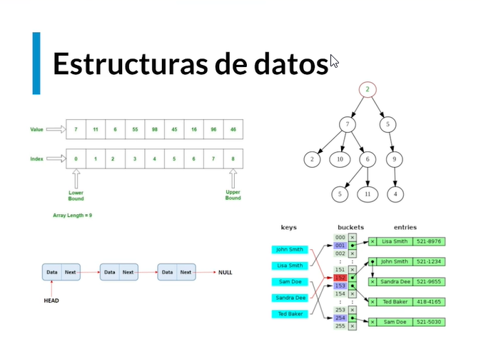

# Estructuras de Datos en JavaScript

## ¿Qué son las estructuras de datos?

Es la forma en la que vamos a guardar y estructurar la información.

Imagina que debes guardar el monton de ropa que acaba de ser lavada, puede ser que en el mejor de los casos te la hayan dejado un poco ordenada para que tu la guardes, en el peor de los casos estara en bruto, quiere decir que te van a dar una bola de ropa y que tienes que doblarla, acomodarla y guardarla. Este es un modelo que nosotros utilizamos todo el tiempo.

Trabajar con estructuras de datos es un modelo que nos permite guardar no solo información sino que muchas otras cosas, como la ropa. Si nos toca guardar la ropa en bruto puede ser que terminemos con un conjunto muy desordenado, ya que metemos la ropa como quepa o como se pueda. Pero si llega alguien mas y tu le pides que te pase alguna prenda, esta persona no sabrá como encontrarla, si vas tu mismo es posible que tambien te cueste un poco, pero sepas donde guardaste las cosas. No quiere decir esa forma de guardar la ropa sea mala, simplemente es un estructura y muy posiblemente no sea la mejor para poder completar la tarea de encontrar una prenda.

Aquí podemos ver que existen otro tipo modelos que nos ayudan a guardar las cosas de mejor manera para así tener acceso a ellas de forma mucho mas simple. ¿Como cuales?, existen formas de organizar la ropa diferente, como por ejemplo, por color, por talla, por marca, por tipo, etc. lo cual nos da una forma de acceso mucho mas facil y no tenemos que estar buscando alguna prenda en especifico en una bola de ropa, lo cual es mucho mas complejo.

Con estas estructuras no es mucho más facil guardarla, podemos incluso hasta ahorrar espacio, en el ejemplo de la bola de ropa puede ser que hasta ocupemos más espacio del que debemos, pero si aprendemos a acomodarla y a guardarla nos vamos a dar cuenta de que posiblemente tenemos mucho mas espacio libre y que podriamos guardar mas cosas, ademas nos es mucho mas facil llegar a prendas muy especificas si las cosas estan ordenadas. Este es un ejemplo de estructuras de datos que nos ayudan a organizar la información.



Existen diferentes formas que nosotros tenemos para poder guardar información, cada una de estas formas nos ayuda a resolver problemas especificos, no todas son buenas para todo.

Las estructuras de datos son colecciones de valores, las relaciones entre ellos y las funciones u operaciones que se pueden aplicar a los datos.

Hay muchos lenguajes de programación que ya tienen estructuras de datos construidas, en donde tu nada mas mandas a llamar la estructura de datos, y empiezas a guardar la información, y hay otros como javascript en donde tendriamos que construirlas de cero para empezar a guardar la información. Lo importante es entender cual es la lógica de estas estructuras de datos, para poder construirlas, ya que entendemos esto cuando nos enfrentemos a algún problema vamos a poder entender que tipo de estructura de datos nos ayuda a resolver de forma muy especifica ese problema, guardando la informacion de forma diferente.

**¿Cual estructura de datos es mejor?**. Ninguna es mejor que otra, todo depende de lo que necesites hacer una se adaptará mejor que la otra para tu problema en cuestión. El objetivo es conocerlas y atacar el problema con la estructura que mejor se adapte.

## Memoria y cómo se guardan los datos


## Arrays


## Strings

Los Strings per se no son una estructura de datos, pero la forma en la que se guardan en memoria es como una estructura de datos.

- **String inmutable** se refiere a que una vez definido no lo podemos cambiar.

```javascript
const saludo = "Hola";
```

- Cabe recalcar que en muchos lenguajes incluyendo JavaScript, los strings son inmutables
  - para generar un cambio en el string sera necesario:
    1. Tomar Todos los datos de los memory slots.
    2. Buscar nuevos memory slots.
    3. Pegar en los memory slots necesarios con los nuevos elementos.
  - Hacer todos estos pasos puede llegar a ser un problema de performance.
- Cuando generamos strings en JavaScript casi nunca tenemos que modificarlos.
- Los strings se guardan como un array de memory slots.


- Teniendo acceso a cada letra dela cadena definida.

Los strings son inmutables, es decir que una vez definidos no podemos cambiar "letra por letra" sino que tendremos que tomar todos lo items y comenzar a realizar la operación deseada, esto tambien significa mayor esfuerzo de computo.

## Hash Tables


De inicio las hash tables son similares a los objetos ya que manejan cosas como las key o los value.


La diferencia entre una hash table a un objeto es un paso extra el cual es que se convierte en una caja negra que seria una hash function.

### ¿Como funcionan?

Esto es, generar un hash que se convierte en el address para poder acceder al valor de lo que estamos guardando.


### Metodos

Insert → Insertar un elemento en la tabla

search → buscar un elemento por key

delete → borrar un elemento

Colision de hash table

Trabajar con has table aveces puede causar problemas

En ocasiones pasar un key distinto me puede generar el mismo hash y eso quiere decir que pueden quedar dos elementos guardado en un mismo indice(bucket)

No hay forma de evitarlo.

### Similares a un JSON

Básicamente una Hash Table es similar a un objeto JSON.

La unica diferencia es que, a la "key" que tu le pases se le va a aplicar una función que convertirá esa key en una referencia de memoria que es en donde se guardarán los valores que tu les pases.

Para obtener de regreso tus valores, tienes que usar esa misma key, que será convertida de nuevo en un hash con la referencia de memoria en donde están guardados tus valores y te los devolverá.


### Funcionan similar a un array

Las Hash Table funcionan similar a un Array, solo que en vez de índices numéricos se tienen índices o keys en caracteres, entonces es necesario una función intermedia que convierte el key en caracteres en índice numérico.


### Colisiones de Hashes

En ocasiones, pasar un valor distinto, me puede generar un mismo hash, lo que produce dos elementos guardados en un mismo bucket. Hash Tables funciona así, dependiendo de los buckets disponibles o libres, es la forma que va a regresar el Hash para guardar la información. Es casi imposible evitar las colisiones.
Es importante aprender cómo tratar una colisión.

La forma de tratar esta colision puede ser otra estructura de datos llamada "linked list".

## Construyendo una Hash Table

### ¿Qué es un Hash?

Según la definición de Kaspersky:

“Una función criptográfica hash- usualmente conocida como “hash”- es un algoritmo matemático que transforma cualquier bloque arbitrario de datos en una nueva serie de caracteres con una longitud fija. Independientemente de la longitud de los datos de entrada, el valor hash de salida tendrá siempre la misma longitud.”

En pocas palabras, un hash es un string aleatorio que se genera a partir de un string que le pasamos nosotros, este string que se genera tendrá una longitud fija, no importa si el string que nosotros le pasamos es muy largo.

El hash se suele usar mucho al momento de encriptar contraseñas, y la forma de calcularlos es mediante un algoritmo matemático.

## ¿Como se llega a cada elemento dentro de los buckets?


## Linked List

**Linked List** son simplemente un conjunto de nodos ordenados que contienen los valores que necesitemos (numbers, strings, boolean, etc). Cada uno tiene un valor y una referencia a un siguiente nodo.


- Esta es la anatomía de un linked list.
- Tenemos el nodo principal o cabeza, luego tenemos diferentes nodos y un nodo final o cola.
- Cada flecha es su conexión.
- Existen dos tipos de Linked List en este caso usaremos solo la **Singly Linked List**.

### Métodos

- Prepend → Agrega un nodo al inicio.
- Append → Agrega un nodo al final.
- Lookup/Search → Busca un nodo.
- Insert → Inserta un nodo en una posición específica.
- Delete → Elimina un nodo.

### Singly Linked List

- Un nodo se compone de dos factores.
  - Valor
  - valor del siguiente nodo


- Si deseamos llegar a algún lugar, debemos empezar del Head hasta el lugar especificado.
- No podemos regresar una vez hemos avanzado en un lugar, sera necesario volver hacer otro recorrido.
- Lo característico de esta lista es que sus valores están relacionados con su nodo actual y el siguiente.

Un singly linked list es aquella que en sus nodos están su valor actual y la relación con el siguiente, si deseamos acceder a un determinado valor debemos recorrer si o si todos los elementos anteriores para llegar al lugar deseado.

### Pueden ser un poco lentas

Una linked listed suele tener la particularidad de “ser un poco lenta” en la búsqueda por el hecho de que tiene que recorrer absolutamente todos los elementos de izquierda a derecha en busca de ese valor.

Un elemento de una linked list (singly) solo conoce al siguiente elemento, pero no conoce al anterior, es por eso que no te puedes regresar, por eso, si necesitas conocer el valor de un nodo anterior no te queda otra opción más que terminar tu búsqueda y volver a iniciarla. Por eso una linked list no sería la mejor opción para hacer búsqueda de elementos que dependen de otro elemento de la misma linked list


*Pensemos en las Singly Linked List como un edificio con escaleras donde cada piso sería un Nodo. Si quisiera ir del piso 1 al piso 5, estoy obligado a pasar por los pisos 2, 3 y 4. Además siempre debo entrar por el primer piso.*

## Construyendo una Singly Linked List


Las Linked List guardan los nodos aleatoriamente en la memoria, sí, aunque esta estructura de datos solo conoce a su siguiente nodo, los nodos pueden estar guardados aleatoriamente en la memoria porque cada nodo sabe cuál es la referencia de memoria del siguiente nodo.

Hay dos formas en las que se puede accesar a la información.

- **Acceso Aleatorio**: Se puede acceder al n-ésimo elemento de una lista de elementos en un tiempo constante. Ejemplo de esto son los arreglos, ya que como se ha mencionado en el curso, se reservan espacios de memorias seguidos (sean arreglos dinámicos o no). Por esto, se puede acceder directamente a las posición 3 de un arreglo (``myArray[2]``).


- **Acceso Secuencial**: En este caso, un grupo de elementos es accedido en un predeterminado orden secuencial. Las linked list son ejemplo de esto. Como no están de manera continua en memoria, para acceder a un nodo en particular, debemos recorrer la lista, accediendo a los apuntadores del siguiente elemento. Es decir, si quiero acceder a la posición 3 de la lista, debo pasar por la posición 1, luego a la 2 y ahí llego a la 3.


## Doubly Linked List

Una doubly linked list tiene el mismo comportamiento que una simply linked list, pero con la particularidad de que esta **SI** puede regresar. Aún necesita ir moviéndose una por una, pero ahora si lo desea puede regresar porque ya conoce quién es su elemento anterior y también quién es el siguiente, es decir, ya no es necesario repetir el ciclo.

